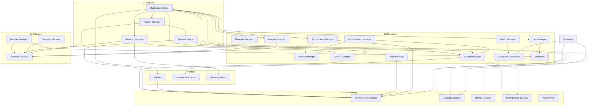

# Integris Daemon Internal Architecture

**Document:** INT-ARCH-0001  
**Status:** Draft normative architecture (pre-implementation)  
**Category:** Architecture / IC-1  
**Language:** Normative English  
**Depends on:** [../security-architecture.md](../security-architecture.md) (IP-A-0001),
[replication-protocol.md](replication-protocol.md) (INT-PROTO-0001),
[configuration.md](configuration.md), [observability.md](observability.md),
[journal.md](journal.md), [transaction.md](transaction.md),
[filesystem-model.md](filesystem-model.md), [cryptography.md](cryptography.md)  
**Criticality:** IC-1 (authority boundaries), IC-2 (recovery/journal ownership),
IC-3 (configuration/resource limits)

## Abstract

This document defines the complete internal architecture of the Integris daemon
family. It separates **logical components** (single responsibilities) from
**OS processes** (security boundaries). Package boundaries alone are not trust
boundaries (IP-A-0001).

The architecture privileges correctness, security, determinism, verifiability,
and architectural simplicity. Dependencies are layered and acyclic. Every
responsibility belongs to exactly one component. Components depend on
abstractions (DIP); concrete adapters sit at the edges.

No implementation code is specified here. Multiple teams MAY implement
components independently if they honour the contracts in this document and
INT-PROTO-0001.

## 1. Conventions

RFC 2119 / RFC 8174 key words apply when capitalized.

| Term | Meaning |
|---|---|
| **Component** | Logical unit with one responsibility and a defined API |
| **Process role** | OS process from the security architecture that hosts components |
| **Conferred resource** | FD, socket, or credential opened by a parent and passed in |
| **Owned data** | State mutable only by its owning component |
| **Port** | Abstract dependency interface (DIP); not a network port |
| **Kernel** | Pure decision/state logic with no I/O side effects |
| **Adapter** | Edge component that performs I/O against OS/network/FS |

## 2. Architectural principles

1. **SRP** — one component, one reason to change.
2. **DIP** — high-level policy depends on ports; adapters implement ports.
3. **Acyclic dependencies** — layers point inward toward pure kernels; no cycles.
4. **Process = security boundary** — components sharing an address space still
   MUST NOT hold authority denied to that process role.
5. **Explicit ownership** — every FD, goroutine, buffer, and key has one owner.
6. **Fail closed** — authorization, identity, journal, and confinement failures
   refuse work; they never degrade into silent success.
7. **Determinism at decision points** — planners, codecs, and recovery consume
   only canonical inputs (INT-IC2-0002).
8. **Correctness over performance** — IC-4 adapters MUST NOT bypass IC-1/IC-2
   barriers.
9. **No ambient authority** — inheritance defaults closed; resources are conferred.
10. **Spec before code** — protocol and transaction semantics live in
    INT-PROTO-0001; this document assigns who executes them.

## 3. Process roles and component placement

Logical components are hosted only in allowed process roles:

| Component | Primary process | May assist (read-only / IPC) | Forbidden processes |
|---|---|---|---|
| Bootstrap | `supervisor` (+ each child entry) | — | — |
| Configuration Manager | `supervisor` (load); digest to all | `verify-config` tool | `net`, `parser` must not reload policy |
| Identity Manager | `auth` | `supervisor` holds policy identity handle only | `net`, `parser`, `apply` |
| Authentication Manager | `auth` | — | `apply`, `journal` |
| Authorization Manager | `auth` | — | `net`, `parser` |
| Session Manager | `auth` (+ session table mirror in `net` as opaque IDs) | `net` forwards frames | `apply` |
| Protocol Engine | `net` + `parser` (decode) + `auth` (session rules) | — | `apply` must not parse hostile wire |
| Replication Engine | orchestrates via `supervisor`/`auth` control plane | `plan`, `apply`, `index` | single process MUST NOT host all |
| Planner | `plan` | — | `net`, `apply` |
| Scheduler | `supervisor` or dedicated control in `auth` | — | `parser` |
| Job Manager | control plane (`auth`/`supervisor`) | — | `parser` |
| Transfer Manager | `net` (bytes) + `apply` (stage) | — | `auth` holds no content |
| Integrity Manager | `apply` (verify) + `index` (source hash) | — | `net` |
| Metadata Manager | `index` / `apply` | `plan` consumes digests | `net` |
| Filesystem Adapter | `index`, `apply` (conferred roots) | — | `net`, `auth`, `parser` |
| Snapshot Manager | `apply` / platform adapter (optional) | — | `net` |
| Recovery Manager | `apply` + `journal` (+ supervisor restart) | — | `parser` |
| Journal Manager | `journal` | `audit` read-only | `net`, `parser` |
| Logging Manager | all (local sink); aggregation via `audit`/supervisor | — | — |
| Audit Manager | `audit` | — | decision components |
| Metrics Manager | all (local); scrape via supervisor IPC | — | must not gate IC-1 barriers |
| Health Manager | `supervisor` (+ per-child probes) | — | — |
| Watcher Manager | `index` (vnode/inotify-class) | — | `net` |
| Event Bus | **per-process only** | never cross-process as bus | cross-process uses IPC |
| Worker Pool | per-process bounded pools | — | unbounded global pool forbidden |
| Shutdown Coordinator | `supervisor` (global); each process local | — | — |

**Normative rule:** Cross-process communication uses the authenticated local IPC
contract ([security-architecture.md](../security-architecture.md)), never a
shared in-memory event bus.

```text
                    ┌─────────────────────────┐
                    │   integrisd-supervisor  │
                    │ Bootstrap, Config load, │
                    │ Scheduler assist,       │
                    │ Health, Shutdown        │
                    └───────────┬─────────────┘
          conferred FDs / IPC   │
    ┌───────────┬───────────┬───┴────┬──────────┬──────────┐
    ▼           ▼           ▼        ▼          ▼          ▼
   net        auth       parser    index      plan       apply
    │           │           │        │          │          │
    │           │           │        │          │          │
 journal ←──── auth/apply (records) ┘          │          │
 audit   ←──── all (redacted events) ──────────┴──────────┘
```

---

## 4. Layered dependency model

Dependencies point **inward**. Outer layers may call inner ports; inner kernels
MUST NOT import adapters.

```text
L0  Platforms / OS  (syscalls, FS, sockets)          ← adapters only
L1  Adapters        (Filesystem, Snapshot, Watcher, net transport)
L2  Engines         (Protocol, Transfer, Replication, Recovery)
L3  Managers        (Session, Authn, Authz, Integrity, Metadata, Journal, Job)
L4  Kernels         (Planner pure, codec, state machines, recovery pure)
L5  Cross-cutting   (Config digest, Logging ports, Metrics ports, Event Bus)
```

Allowed dependency direction: `L1 → L2 → L3 → L4` and all may use `L5` ports.
Forbidden: `L4 → L1`, `L3 → L1` except through injected ports, any cycle.

---

## 5. Component catalogue

For each component: responsibility, owned data, public API (logical), allowed /
forbidden dependencies, invariants, init, shutdown, errors, concurrency.

APIs are logical method names, not Go identifiers. Implementations map them to
IPC messages or in-process calls within the same process role.

### 5.1 Bootstrap

| Aspect | Definition |
|---|---|
| **Responsibility** | Process entry: parse argv, locate config path, create root context, hand off to Configuration Manager, then role-specific main |
| **Owned data** | Process role ID, startup flags, root `context.Context` |
| **API** | `Start(role, args) → RunningProcess` |
| **Allowed deps** | Configuration Manager port, Logging port, Shutdown Coordinator |
| **Forbidden deps** | Protocol Engine, Filesystem Adapter (archive), Identity Manager secrets |
| **Invariants** | No product authority before config validation; role immutable after start |
| **Init** | First code in each process |
| **Shutdown** | Cancels root context; does not itself close conferred FDs (owners do) |
| **Errors** | Fatal exit with stable code; no retry loops in Bootstrap |
| **Concurrency** | Single-threaded until role main spawns owned goroutines |

### 5.2 Configuration Manager

| Aspect | Definition |
|---|---|
| **Responsibility** | Load, validate, canonicalize configuration; publish immutable snapshot + digest ([configuration.md](configuration.md)) |
| **Owned data** | `ConfigSnapshot` (immutable), schema version, digest |
| **API** | `Load(path)→Snapshot`; `Validate(bytes)→Snapshot`; `Digest(snapshot)→H`; `BeginReload()→NewSnapshot` (supervisor only) |
| **Allowed deps** | Logging, Audit (reload events), secret-reference resolver port (no secret bytes in files) |
| **Forbidden deps** | Session/Replication engines; archive FS; network |
| **Invariants** | Active transactions see frozen digest; reload never mutates in-flight txn policy |
| **Init** | Before any listener or key use |
| **Shutdown** | Drop snapshot references; no flush required |
| **Errors** | Reject unknown critical fields; fail closed |
| **Concurrency** | Snapshot is immutable and freely readable; reload publishes new pointer atomically |

**Hot reload:** MAY be provided by supervisor. Effect = new sessions use new
digest; in-flight transactions continue under old digest until confirm/cancel.
Schema downgrade refused without signed migration.

### 5.3 Identity Manager

| Aspect | Definition |
|---|---|
| **Responsibility** | Long-term node identity handles; trust roots; revocation views |
| **Owned data** | Identity key handles (not raw key bytes in general-purpose memory if OS store available), trust anchor digests |
| **API** | `LocalIdentity()`; `PeerTrusted(id)→bool`; `RevocationView()` |
| **Allowed deps** | Config digest, OS keystore port, Audit (identity events) |
| **Forbidden deps** | Network sockets, archive FS, Journal writes, Parser |
| **Invariants** | Private keys never leave `auth` process; never logged |
| **Init** | After config; before Authentication Manager accepts work |
| **Shutdown** | Zeroize/release handles; revoke in-memory material |
| **Errors** | Missing/invalid identity → refuse start |
| **Concurrency** | Read-mostly; mutations (rotation) serialized and audited |

### 5.4 Authentication Manager

| Aspect | Definition |
|---|---|
| **Responsibility** | Mutual peer authentication, transcript binding, session key derivation (INT-PROTO-0001 §5) |
| **Owned data** | Ephemeral handshake state, derived traffic key handles (may be conferred to `net` as sealed FD) |
| **API** | `BeginHandshake(session)`; `Advance(msg)→msg`; `SealKeys()→KeyHandles`; `Erase(session)` |
| **Allowed deps** | Identity Manager, Config, Session Manager, Protocol ports, Audit/Security events |
| **Forbidden deps** | Apply/FS mutation, Journal policy decisions, raw hostile parser beyond typed fields |
| **Invariants** | No `ACTIVE` without mutual auth; erase on `FAILED` |
| **Init** | Ready when Identity Manager ready |
| **Shutdown** | Erase all ephemeral state |
| **Errors** | Any verify fail → session `FAILED` |
| **Concurrency** | One handshake state machine per session ID; no shared mutable transcript across sessions |

### 5.5 Authorization Manager

| Aspect | Definition |
|---|---|
| **Responsibility** | Bind and verify transaction authorization (INT-IC1-0004); archive role checks; destructive thresholds gate |
| **Owned data** | Authorization policy view (from config digest), issued authz records digests |
| **API** | `Authorize(txnBindings)→AuthzToken`; `Verify(token, bindings)→ok`; `Reject(reason)` |
| **Allowed deps** | Identity, Config, Planner digests (inputs), Audit |
| **Forbidden deps** | Transfer Manager content path; Filesystem Adapter mutation |
| **Invariants** | Token valid only for exact binding digests; expiry enforced |
| **Init** | After Identity + Config |
| **Shutdown** | Invalidate pending tokens |
| **Errors** | Mismatch → permanent refuse |
| **Concurrency** | Pure verify is concurrent; issue path serialized per txn ID |

### 5.6 Session Manager

| Aspect | Definition |
|---|---|
| **Responsibility** | Session state machine (INT-PROTO-0001 §4); sequence spaces; credits; resume checkpoints |
| **Owned data** | Session table: state, sequences, credits, checkpoint refs |
| **API** | `Create`; `Transition(event)`; `Lookup`; `Close`; `Fail`; `ExportCheckpoint` |
| **Allowed deps** | Authentication, Authorization (archive phase), Protocol Engine ports, Metrics, Audit |
| **Forbidden deps** | Planner, Apply FS, Journal append (may request journal via IPC) |
| **Invariants** | INV-S1…S3; product mutation flag only when `ACTIVE` |
| **Init** | Empty table; capacity from config |
| **Shutdown** | Fail or close all sessions; erase secrets via Authentication Manager |
| **Errors** | Illegal transition → `FAILED` |
| **Concurrency** | Per-session mutex or actor goroutine; table map guarded; max sessions enforced before insert |

### 5.7 Protocol Engine

| Aspect | Definition |
|---|---|
| **Responsibility** | Frame encode/decode (IP-P), flow control, message dispatch to session/replication; hostile input refusal |
| **Owned data** | Codec limits, per-conn read/write state in `net`; decoded typed messages in `parser` |
| **API** | `ReadFrame`; `WriteFrame`; `Dispatch(typedMsg)`; `Reject(code)` |
| **Allowed deps** | Session Manager (via IPC/auth), Config limits, Metrics, Logging |
| **Forbidden deps** | Authorization decisions, archive FS, Journal |
| **Invariants** | Lengths validated before alloc; unknown critical → fail session |
| **Init** | After listener FDs conferred |
| **Shutdown** | Drain/reject writes; close conns owned by `net` |
| **Errors** | Protocol class → session fail; never retry as temporary |
| **Concurrency** | One reader + one writer goroutine per connection (or equivalent); no shared conn state without sync |

### 5.8 Replication Engine

| Aspect | Definition |
|---|---|
| **Responsibility** | Drive INT-PROTO-0001 transaction cycle across processes; phase orchestration only |
| **Owned data** | Transaction control records (IDs, phase, digests), not file bytes |
| **API** | `StartTxn`; `AdvancePhase`; `Cancel`; `Query` |
| **Allowed deps** | Session, Authorization, Planner port, Transfer port, Integrity port, Recovery port, Journal port, Job Manager |
| **Forbidden deps** | Direct OS FS syscalls; raw sockets; Identity private keys |
| **Invariants** | Phase order never skipped; no publish without authz+verify |
| **Init** | Idle; waits for authorized session |
| **Shutdown** | Suspend in-flight txns; request recovery marks |
| **Errors** | Map to protocol error classes; propagate to Job Manager |
| **Concurrency** | One control actor per txn ID; global limit on concurrent txns |

### 5.9 Planner

| Aspect | Definition |
|---|---|
| **Responsibility** | Deterministic canonical plan (IP-S-0002); conflict classification |
| **Owned data** | Ephemeral plan build buffers; no durable authority |
| **API** | `Build(manifest, caps, configDigest, limits)→Plan+Digest` |
| **Allowed deps** | Codec/kernel, Filesystem capability digests (inputs only), Logging |
| **Forbidden deps** | Network, Journal, Authorization signing, Apply mutation |
| **Invariants** | Byte-identical outputs for identical inputs; refuse UNKNOWN/UNREPRESENTABLE by default |
| **Init** | Stateless service ready |
| **Shutdown** | Cancel in-flight builds via context |
| **Errors** | Limit exceeded → refuse; never partial authorize |
| **Concurrency** | CPU-bound workers in pool; no shared mutable plan cache unless digest-keyed immutable |

### 5.10 Scheduler

| Aspect | Definition |
|---|---|
| **Responsibility** | Decide *when* jobs/replication attempts run (timers, priorities, backoff) |
| **Owned data** | Schedules, backoff state per job key |
| **API** | `Schedule(job, when)`; `Cancel`; `Next()` / wake channel |
| **Allowed deps** | Config, Job Manager, Metrics, Clock observation port (not safety ordering) |
| **Forbidden deps** | Protocol parse, FS mutation, Authn secrets |
| **Invariants** | Does not authorize; only orders attempts; respects `N_MAX` retry policy |
| **Init** | After Config |
| **Shutdown** | Stop timers; do not start new jobs |
| **Errors** | Overload → delay/admit fail |
| **Concurrency** | Single scheduler goroutine or heap+mutex; timer channel |

### 5.11 Job Manager

| Aspect | Definition |
|---|---|
| **Responsibility** | Job lifecycle records (queued/running/succeeded/failed/suspended); ties to txn IDs |
| **Owned data** | Job table, terminal reasons (redacted) |
| **API** | `Enqueue`; `BindTxn`; `Complete`; `Fail`; `List` |
| **Allowed deps** | Scheduler, Replication Engine, Audit, Metrics |
| **Forbidden deps** | FS adapters, Parser |
| **Invariants** | Terminal states immutable; no success without Replication Engine confirm signal |
| **Init** | Empty/persistent resume from journal checkpoint if configured |
| **Shutdown** | Mark running as suspended |
| **Errors** | Duplicate job keys → reject or idempotent attach |
| **Concurrency** | Mutex/map per job ID; bounded queue |

### 5.12 Transfer Manager

| Aspect | Definition |
|---|---|
| **Responsibility** | Move content bytes session→staging with credits, offsets, stall timers |
| **Owned data** | Per-txn transfer watermarks; staging write handles (in `apply`) |
| **API** | `OpenTransfer`; `WriteChunk`; `Watermark`; `Close` |
| **Allowed deps** | Protocol Engine (data msgs), Filesystem Adapter (stage), Integrity (post-write hash), Metrics |
| **Forbidden deps** | Authorization Manager (must already be authorized), Planner |
| **Invariants** | No publish; gaps/replays refused when tracking on; credits enforced |
| **Init** | Per authorized txn |
| **Shutdown** | Abort incomplete transfers; leave recovery to Recovery Manager |
| **Errors** | Temporary vs permanent per INT-PROTO-0001 §12 |
| **Concurrency** | At most one writer per staged object; session writer goroutine feeds IPC |

### 5.13 Integrity Manager

| Aspect | Definition |
|---|---|
| **Responsibility** | Hash/verify content and metadata; cache invalidation rules (INT-PROTO-0001 §10) |
| **Owned data** | Optional digest cache with binding keys; verify reports |
| **API** | `HashSource`; `HashStaged`; `Verify(manifestEntry, object)→Report` |
| **Allowed deps** | Filesystem Adapter, Config suite, Metrics |
| **Forbidden deps** | Network, Authorization issuance |
| **Invariants** | INV-T1; cache miss on weak binding |
| **Init** | Ready with algorithm suite from session/config |
| **Shutdown** | Drop caches |
| **Errors** | Mismatch → permanent for sealed object |
| **Concurrency** | Parallel hashes via Worker Pool within limits; cache structure synchronized |

### 5.14 Metadata Manager

| Aspect | Definition |
|---|---|
| **Responsibility** | Read/canonicalize object metadata; capability-facing attribute views |
| **Owned data** | Ephemeral metadata records for index/apply |
| **API** | `Stat`; `ReadXattr`; `Canonicalize`; `Compare` |
| **Allowed deps** | Filesystem Adapter, filesystem-model rules |
| **Forbidden deps** | Protocol Engine, Journal append |
| **Invariants** | Canonicalization deterministic; no silent drop of required attrs |
| **Init** | Bound to conferred root |
| **Shutdown** | Release caches |
| **Errors** | Unrepresentable → signal Planner/Replication |
| **Concurrency** | Read-mostly; directory iteration bounded |

### 5.15 Filesystem Adapter

| Aspect | Definition |
|---|---|
| **Responsibility** | Descriptor-relative FS ops; probes; sync/rename/dirsync per publication profile |
| **Owned data** | Conferred root/staging/quarantine FDs; probe results |
| **API** | `Openat`; `StageCreate`; `SyncFile`; `PublishRename`; `QuarantineMove`; `ProbeCaps` |
| **Allowed deps** | Platform ports only; path grammar kernel (IP-S-0001) |
| **Forbidden deps** | Network, Identity keys, Session crypto |
| **Invariants** | INT-IC1-0002; no stringly ambient paths; volume identity checks |
| **Init** | Receives FDs from supervisor/launcher |
| **Shutdown** | Close owned FDs after in-flight ops drain |
| **Errors** | ESTALE/identity change → refuse mutation |
| **Concurrency** | Document per-FD rules; directory mutation serialized per parent where required by profile |

### 5.16 Snapshot Manager

| Aspect | Definition |
|---|---|
| **Responsibility** | Optional consistent-view snapshots for discovery where platform supports; never required for correctness if probes refuse |
| **Owned data** | Snapshot handles / generation IDs |
| **API** | `TrySnapshot(root)→Handle|Unsupported`; `Release` |
| **Allowed deps** | Filesystem Adapter / platform |
| **Forbidden deps** | Protocol, Auth |
| **Invariants** | If Unsupported, Planner uses live tree with documented races → still hash-verify before confirm |
| **Init** | Lazy |
| **Shutdown** | Release snapshots |
| **Errors** | Failure → fall back or refuse per policy (no silent inconsistency claim) |
| **Concurrency** | One snapshot op at a time per root unless platform allows |

### 5.17 Recovery Manager

| Aspect | Definition |
|---|---|
| **Responsibility** | Idempotent crash recovery (IP-S-0003, INT-PROTO-0001 §8) |
| **Owned data** | Recovery decision reports; no invented authz |
| **API** | `Recover(txn|all)→StableState`; `LabelFaultPoints` (test harness) |
| **Allowed deps** | Journal Manager (read prefix), Filesystem Adapter (observe), Replication state ports |
| **Forbidden deps** | Network peer trust for inventing success; Authorization minting |
| **Invariants** | INV-T6; RecoverAgain effect-free |
| **Init** | Runs before accepting new txns after crash/restart |
| **Shutdown** | Must complete or leave QUARANTINED/IRRECOVERABLE evidence |
| **Errors** | Contradiction → IRRECOVERABLE |
| **Concurrency** | Single recovery worker globally (or per archive serialized) |

### 5.18 Journal Manager

| Aspect | Definition |
|---|---|
| **Responsibility** | Append-only journal segments; prefix reader; commitments (journal.md, IP-F-0001) |
| **Owned data** | Journal FD/segment, sequence head, write buffer until barrier |
| **API** | `Append(record)`; `Sync`; `ReadPrefix`; `Checkpoint` |
| **Allowed deps** | Codec, Config limits, Filesystem durability port for journal volume |
| **Forbidden deps** | Policy decisions, Network, Authorization logic |
| **Invariants** | INV-J1; never overwrite committed bytes |
| **Init** | Open conferred journal FD; validate head |
| **Shutdown** | Sync pending; close FD |
| **Errors** | Interior corrupt → fatal; torn tail → report |
| **Concurrency** | Single writer goroutine; readers concurrent on immutable prefix snapshots |

### 5.19 Logging Manager

| Aspect | Definition |
|---|---|
| **Responsibility** | Operational + diagnostic logs; redaction; backpressure ([observability.md](observability.md)) |
| **Owned data** | Ring/queue of log records; drop counters |
| **API** | `Info/Debug/Error(eventID, fields)`; `SetLevel` |
| **Allowed deps** | Config redaction policy |
| **Forbidden deps** | Journal (must not be substitute evidence); secrets |
| **Invariants** | Never log keys, contents, raw payloads; drops never block IC-1 journal barriers indefinitely |
| **Init** | Early in Bootstrap |
| **Shutdown** | Flush best-effort; bounded time |
| **Errors** | Queue full → drop + metric |
| **Concurrency** | Async logger goroutine; non-blocking emit API |

### 5.20 Audit Manager

| Aspect | Definition |
|---|---|
| **Responsibility** | Immutable-ish audit/security event sink; read-only journal observation |
| **Owned data** | Audit stream FDs; last sequences |
| **API** | `SecurityEvent`; `AuditEvent`; `AttachJournalRead` |
| **Allowed deps** | Logging (optional mirror), Config |
| **Forbidden deps** | Replication decisions, Apply mutation, Auth private keys |
| **Invariants** | Audit cannot authorize; mandatory events listed in §10 |
| **Init** | After supervisor confers sink |
| **Shutdown** | Sync audit stream |
| **Errors** | Capacity → suspend new txns (not false success) |
| **Concurrency** | Single writer; producers use bounded IPC |

### 5.21 Metrics Manager

| Aspect | Definition |
|---|---|
| **Responsibility** | Counters/gauges/histograms; export for scrape |
| **Owned data** | Metric registry |
| **API** | `Inc`; `Observe`; `Snapshot` |
| **Allowed deps** | Config cardinality limits |
| **Forbidden deps** | Controlling txn success paths |
| **Invariants** | Label cardinality bounded; no secret labels |
| **Init** | Early |
| **Shutdown** | Final scrape optional |
| **Errors** | Over-cardinality → reject metric |
| **Concurrency** | Lock-free or sharded counters preferred |

### 5.22 Health Manager

| Aspect | Definition |
|---|---|
| **Responsibility** | Liveness/readiness of supervisor and children; aggregate status |
| **Owned data** | Child probe results, ready flags |
| **API** | `Liveness()→ok`; `Readiness()→ok`; `ChildStatus` |
| **Allowed deps** | Supervisor IPC, Metrics |
| **Forbidden deps** | Deep archive scans on probe path |
| **Invariants** | Ready only if recovery complete and mandatory children alive; live ≠ ready |
| **Init** | With supervisor |
| **Shutdown** | Report not-ready first |
| **Errors** | Probe timeout → not-ready / restart policy |
| **Concurrency** | Probe loop goroutine |

### 5.23 Watcher Manager

| Aspect | Definition |
|---|---|
| **Responsibility** | FS change notifications to trigger rescan/schedule (platform vnode/kqueue/inotify-class) |
| **Owned data** | Watch descriptors, event queue |
| **API** | `Watch(root)`; `Events()←`; `Close` |
| **Allowed deps** | Filesystem Adapter / platform, Scheduler (wake), Metrics |
| **Forbidden deps** | Applying mutations from watch alone without plan/authz |
| **Invariants** | Watches are hints; correctness still via manifest+hash |
| **Init** | Optional after index ready |
| **Shutdown** | Close watches; drain queue |
| **Errors** | Queue overflow → force full rescan signal |
| **Concurrency** | One reader goroutine per watch backend |

### 5.24 Event Bus (internal, per-process)

| Aspect | Definition |
|---|---|
| **Responsibility** | In-process pub/sub for non-IC-1 signals (metrics hooks, diag, scheduler wakes) |
| **Owned data** | Topic→subscriber queues |
| **API** | `Publish`; `Subscribe`; `Close` |
| **Allowed deps** | Config capacity |
| **Forbidden deps** | Cross-process use; carrying secrets; replacing Journal/Audit for mandatory evidence |
| **Invariants** | Bounded queues; slow subscriber → drop/disconnect policy, never block journal Sync |
| **Init** | Per process |
| **Shutdown** | Close topics |
| **Errors** | Full queue → drop+metric or disconnect |
| **Concurrency** | Channel-based; no global lock across topics if avoidable |

### 5.25 Worker Pool

| Aspect | Definition |
|---|---|
| **Responsibility** | Bounded CPU/IO task execution (hash, plan shards, parse) |
| **Owned data** | Worker goroutines, task queue |
| **API** | `Submit(ctx, task)`; `Stats` |
| **Allowed deps** | Config limits, Metrics |
| **Forbidden deps** | Creating nested unbound pools; holding FDs across tasks without ownership rules |
| **Invariants** | Queue+workers capped; context cancellation honored |
| **Init** | Size from config at process start |
| **Shutdown** | Cancel ctx; drain or abandon per policy (abandon only non-durable tasks) |
| **Errors** | Admit fail when full |
| **Concurrency** | Classic pool; tasks MUST NOT acquire locks in cyclic order with session locks |

### 5.26 Shutdown Coordinator

| Aspect | Definition |
|---|---|
| **Responsibility** | Ordered graceful/forced stop; crash restart orchestration at supervisor |
| **Owned data** | Phase of shutdown, child exit statuses |
| **API** | `Graceful(ctx)`; `Forced()`; `OnChildExit` |
| **Allowed deps** | All stop hooks (registered), Health, Audit |
| **Forbidden deps** | Starting new replication during shutdown |
| **Invariants** | Order in §8; never report success for incomplete txn |
| **Init** | Supervisor owns global; each process has local coordinator |
| **Shutdown** | N/A (it drives shutdown) |
| **Errors** | Timeout → escalate to forced |
| **Concurrency** | Single shutdown goroutine; stop hooks sync with budgets |

---

## 6. Process lifecycle

### 6.1 Cold start (supervisor)

```text
1. Bootstrap(supervisor)
2. Configuration Manager Load+Validate → immutable Snapshot0
3. Logging/Metrics/Audit sinks open (conferred or created)
4. Health Manager = not ready
5. Open IPC sockets / pipes; prepare child argv and AllowRoots
6. Launch children with conferred FDs (monotonic authority reduction)
7. Each child: Bootstrap → validate role config slice → init components → ready ping
8. Recovery Manager (apply/journal path) runs to stable state
9. Health Manager readiness = true only after recovery + mandatory children ready
10. net opens/accepts listeners (conferred listen FD)
11. Scheduler may enqueue jobs
```

### 6.2 Connection and session

```text
net accept → Protocol Engine frames → parser types messages →
auth Session+Authentication+Authorization → ACTIVE →
Replication Engine may StartTxn → plan/index/apply/journal collaborate →
Confirm → Job complete → optional Close
```

### 6.3 Synchronization (transaction)

Owned by Replication Engine orchestration; execution distributed:

1. Discovery: `index` + Metadata + optional Snapshot + Integrity (source)
2. Planning: `plan` Planner
3. Authorization: `auth` Authorization Manager
4. Transfer: `net` + `apply` Transfer Manager
5. Verify: Integrity Manager on staged
6. Publish: Filesystem Adapter publication profile
7. Journal + Confirm: Journal Manager + Replication Engine
8. Cleanup: staging removal idempotent
9. Audit mandatory events

### 6.4 Graceful shutdown

```text
operator signal → Shutdown Coordinator (supervisor)
  → readiness false
  → Scheduler stop admitting
  → net stop accept; session Close budget T_CLOSE
  → Replication Engine suspend/cancel pre-publish; wait publish budgets
  → Journal Sync
  → children exit in reverse dependency order (§8.3)
  → supervisor exit
```

### 6.5 Forced shutdown

Immediate cancel of root contexts; best-effort Journal Sync with short budget;
unrefined exits; next start MUST run Recovery Manager before readiness.

### 6.6 Restart after crash

Supervisor policy restarts children (IP-A-0003 supervised launcher). Before
ready:

1. Journal prefix validate
2. Recovery Manager for incomplete txns
3. Session tables empty (new handshakes only)
4. Then accept traffic

---

## 7. Concurrency model

### 7.1 Dedicated goroutines (normative minimum)

| Location | Goroutine | Owner |
|---|---|---|
| supervisor | child wait / restart loop | Shutdown/Health |
| supervisor | health probe loop | Health Manager |
| supervisor | scheduler timer loop (if hosted) | Scheduler |
| net | accept loop | Protocol Engine |
| net | per-conn read loop | Protocol Engine |
| net | per-conn write loop | Protocol Engine |
| net | heartbeat loop | Session/Protocol |
| auth | per-session actor (or mutex equivalent) | Session Manager |
| parser | worker pool tasks | Worker Pool |
| plan | worker pool tasks | Worker Pool |
| index | watcher read loop | Watcher Manager |
| apply | per-txn apply actor | Replication/Transfer |
| journal | single writer | Journal Manager |
| each process | logger async | Logging Manager |
| each process | metrics (optional) | Metrics Manager |
| each process | local shutdown waiter | Shutdown Coordinator |

No component MAY spawn unbounded goroutines per message.

### 7.2 Channels vs mutexes

| Pattern | Use |
|---|---|
| **Channels** | Scheduler wakes, watcher events, per-conn write queue, journal append requests, event bus |
| **Mutex / RWMutex** | Session table, job table, metric registry, FD maps |
| **Actor (goroutine+inbox)** | Per-session and per-txn control planes (preferred to fine-grained locks) |

### 7.3 Ownership

- Bytes buffers: owned by Protocol Engine until transferred via IPC copy/loan rules; apply owns staged file FDs.
- Session secrets: Authentication Manager; sealed key FD conferred to net for AEAD.
- Journal head: Journal Manager only.
- Config snapshot: immutable shared read.

### 7.4 Deadlock avoidance

1. Global lock order if locks unavoidable: `Job → Session → Transfer → FS parent inode`.
2. Prefer actor mailboxes over multi-lock holds.
3. IPC calls MUST use deadlines (`context` + `T_*` timeouts from INT-PROTO-0001).
4. Journal writer NEVER synchronously waits on Audit/Logging completion.
5. Net NEVER waits on Apply with a hold on accept mutex.

### 7.5 Race freedom

- Shared memory only within a process; cross-process state via IPC messages.
- Immmutable digests/plans shared by reference.
- Go race detector REQUIRED in CI for all packages.
- Publication profiles define FS linearization; code MUST not invent extra races.

### 7.6 Cancellation

- Root `context.Context` per process from Bootstrap.
- Per-session and per-txn derived contexts.
- Shutdown cancels root; workers observe `ctx.Done()`.
- IPC deadlines are independent safety timers; context cancel MUST still free local resources.

---

## 8. Communication model

### 8.1 Synchronous (request/response IPC or in-process call)

- Authn/Authz decisions
- Plan build
- Journal append+sync (caller waits for durability)
- Integrity verify before phase advance
- Health probes

### 8.2 Asynchronous

- Operational logs
- Metrics
- Watcher hints → Scheduler
- Event Bus diagnostics
- Heartbeats

### 8.3 Internal events (per-process bus topics examples)

`session.failed`, `txn.suspended`, `watcher.dirty`, `resource.pressure`,
`shutdown.phase` — all advisory unless a Manager also journals.

### 8.4 Queues and backpressure

| Queue | Bound | Full behaviour |
|---|---|---|
| Accept backlog | config | refuse connect |
| Per-conn write | credits | apply Protocol flow control |
| Parser tasks | config | fail session or delay accept |
| Journal ingress | config | block callers with timeout → suspend txns |
| Log/diag | config | drop + metric |
| Audit | config | suspend new txns |
| Scheduler job queue | config | reject enqueue |

### 8.5 Error propagation

```text
Adapter/Engine error → typed ErrorClass (temporary|permanent|protocol|security|resource)
  → Replication/Session Manager maps to state transition
  → Job Manager terminal or suspend
  → Audit/Security if class warrants
  → Metrics
```

Security/protocol errors MUST NOT be converted into temporary retries.

---

## 9. Configuration architecture

1. **Load** — supervisor reads file/bytes; children receive canonical snapshot or digest + conferred subset.
2. **Validate** — schema version, bounds, no unknown critical fields; `integris-verify-config` shares logic.
3. **Immutable snapshot** — `ConfigSnapshot` + digest `H_cfg` bound into sessions/txns.
4. **Hot reload** — supervisor-only; publish `Snapshot1`; new sessions only; audit old/new digests.
5. **Versioning** — schema migrations explicit; downgrade refused without signed migration proof.

Secrets: references only in config files; Identity Manager resolves via OS store.

---

## 10. Logging, audit, and security events

| Channel | Owner | Purpose | Examples |
|---|---|---|---|
| Operational log | Logging Manager | Run-time behaviour | child restart, listen up, job scheduled |
| Diagnostic log | Logging Manager | Debug (optional verbosity) | phase timings, queue depths |
| Audit log | Audit Manager | Accountable actions | config reload, authz grant/deny, purge auth |
| Security event | Audit Manager | Threat-relevant | MAC fail, downgrade, replay, role mismatch |
| Journal | Journal Manager | Integrity evidence | txn phase records (primary) |

### 10.1 Mandatory recorded events

MUST be auditable/journaled as applicable:

- process start/stop with role and config digest
- config load/reload digests
- session `FAILED` with stable redacted cause class
- peer auth success/failure (no secrets)
- archive auth success/failure
- authorization issue/refuse (binding digests)
- txn phase transitions that require journal records (INT-PROTO-0001 §11)
- destructive threshold hard-stop
- recovery decisions and IRRECOVERABLE
- shutdown graceful/forced
- confinement probe failure at start

---

## 11. Observability

| Signal | Definition |
|---|---|
| **Metrics** | sessions active, txns by phase, retry counts, hash bytes, journal append latency, drops, IPC errors |
| **Liveness** | process alive / supervisor loop running |
| **Readiness** | recovery done + mandatory children ready + journal writable + config valid |
| **Diagnostics** | bounded dumps of session/txn IDs and states (redacted) |
| **Internal tracing** | optional span IDs correlating IPC requests; MUST NOT include secrets/paths beyond policy |

Tracing is diagnostic; journal remains authoritative for integrity claims.

---

## 12. Resource ownership and destruction order

### 12.1 Who opens / owns / closes

| Resource | Opened by | Owned by | Closed by |
|---|---|---|---|
| Listen socket | supervisor | net | net on shutdown |
| Conn sockets | net | net | net |
| IPC sockets | supervisor | endpoints per role | each endpoint owner |
| Identity handles | auth (via OS) | Identity Manager | auth shutdown |
| Traffic key FD | auth | net (conferred) | net then auth erase |
| Archive/staging/quarantine FDs | supervisor/launcher | apply/index | apply/index shutdown |
| Journal FD | supervisor | Journal Manager | journal shutdown |
| Watch FDs | index | Watcher Manager | Watcher shutdown |
| Worker pools | each process | Worker Pool | pool shutdown |
| Log sinks | supervisor/child | Logging Manager | logging shutdown |

### 12.2 Destruction order (graceful, supervisor-driven)

```text
1. Health readiness ← false
2. Scheduler / Job admit stop
3. net: stop accept → close sessions → close conns → return key FDs
4. auth: fail sessions → erase secrets
5. parser: drain/cancel
6. plan/index: cancel workers; close watches
7. apply: finish/suspend publish; Recovery note; close archive FDs
8. journal: final Sync → close
9. audit: sync → close
10. metrics/logging flush
11. supervisor exit
```

On error mid-shutdown: escalate to forced after `T_CLOSE` budgets; recovery
repairs on next start.

---

## 13. Dependency diagram



Dashed lines are cross-cutting ports. No edge may form a cycle; new edges MUST
be reviewed against this diagram.

### 13.1 Forbidden dependency examples

- Filesystem Adapter → Protocol Engine
- Journal Manager → Authorization Manager
- Planner → Transfer Manager
- Metrics Manager → Replication Engine control API
- Event Bus → cross-process Journal
- net process → archive FDs

---

## 14. Mapping to Go modules (non-normative placement hint)

Future packages SHOULD follow component names under process-constrained
binaries, e.g. `internal/session`, `internal/plan`, `internal/journal`,
`internal/recovery`, already aligned. New components MUST document their process
role in the package doc comment. This hint does not authorize merging process
roles.

---

## 15. Conformance checklist for implementers

An implementation of a component is architecturally conformant only if:

1. It runs only in an allowed process role (§3).
2. It exposes no authority outside its API and owned data (§5).
3. Dependencies are subset of allowed sets and preserve layering (§4, §13).
4. Lifecycle hooks honour init/shutdown and resource ownership (§6, §12).
5. Concurrency matches §7 (bounds, contexts, no lock cycles).
6. Mandatory events are emitted (§10).
7. Protocol/transaction semantics defer to INT-PROTO-0001 without local shortcuts.
8. Tests include race detector coverage and hostile IPC cases where on a boundary.

---

## 16. Open items

1. Exact IPC message schemas per port (future IP-A / IP-I).
2. Whether Scheduler lives in supervisor vs auth (default: supervisor admits,
   auth validates session-gated execution).
3. Snapshot Manager requirement level per platform matrix evidence.
4. Multi-archive scheduling fairness policy (config-versioned).

These MUST be closed by IP before interoperability freeze; they MUST NOT create
undefined component responsibilities—defaults in this document apply until
superseded.

---

## 17. References

- [../security-architecture.md](../security-architecture.md) — process authority map  
- [replication-protocol.md](replication-protocol.md) — protocol state machines  
- [configuration.md](configuration.md) — config immutability  
- [observability.md](observability.md) — channels and redaction  
- [../ip/IP-A-0001-privilege-separation.md](../ip/IP-A-0001-privilege-separation.md)  
- [../ip/IP-A-0003-supervised-launcher.md](../ip/IP-A-0003-supervised-launcher.md)  
- [../ip/IP-A-0002-bounded-local-ipc.md](../ip/IP-A-0002-bounded-local-ipc.md)

End of INT-ARCH-0001.
