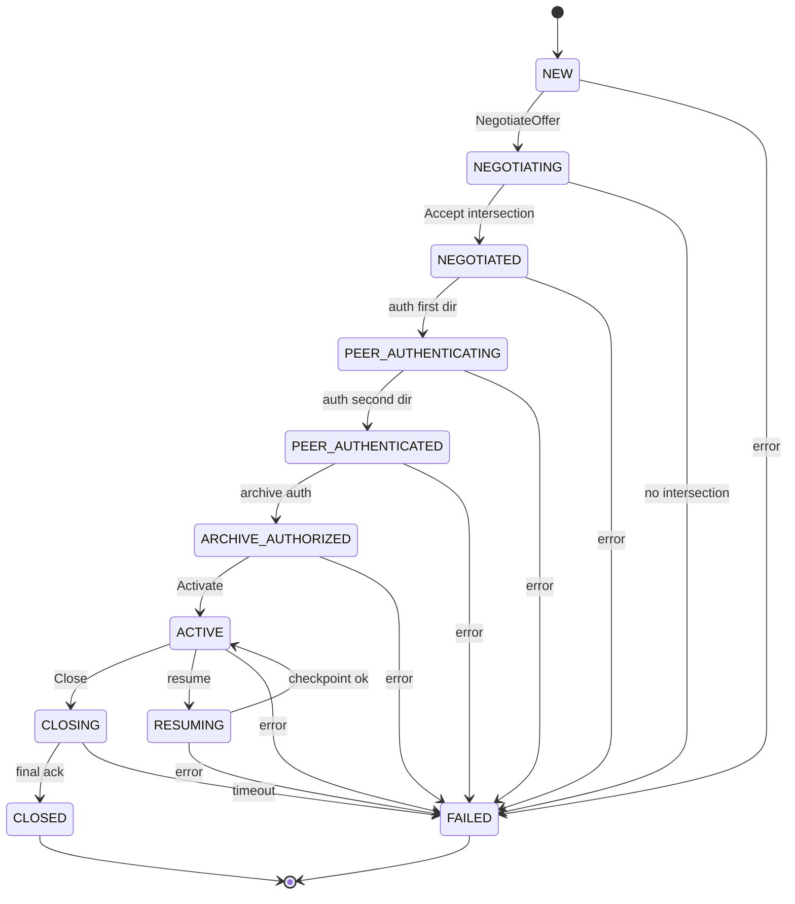
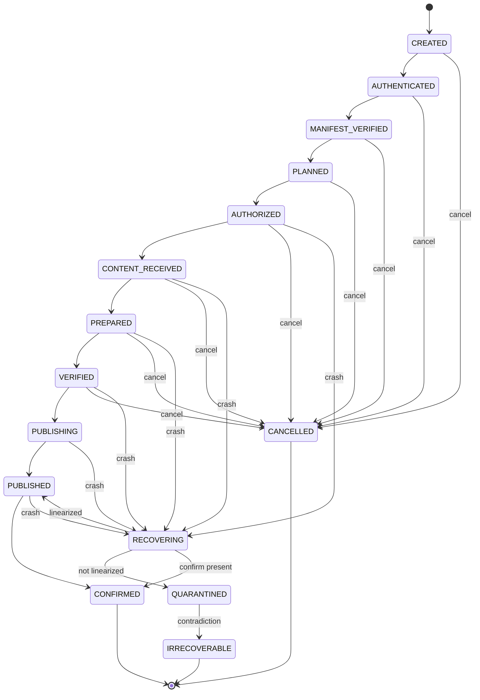
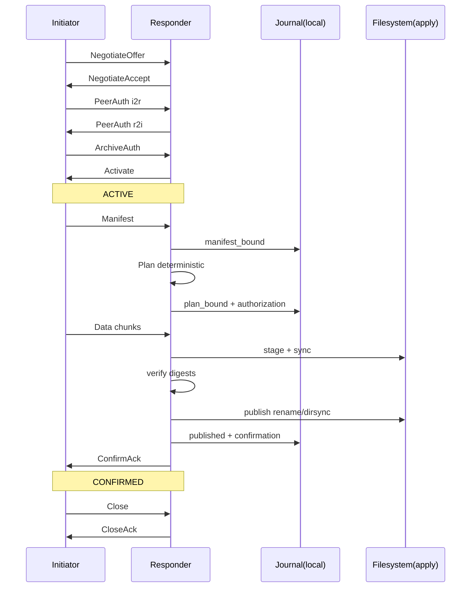
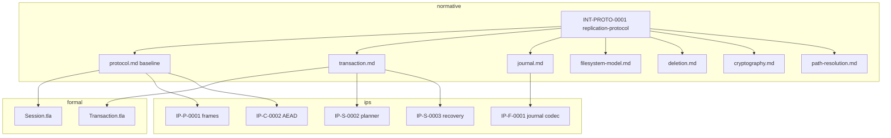
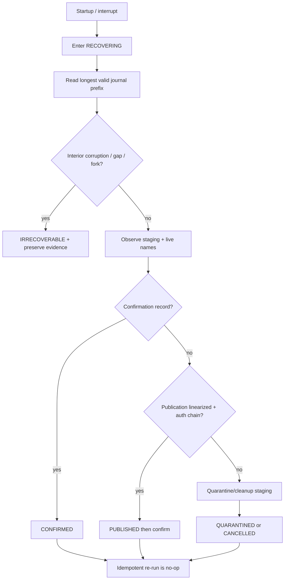

# Integris Replication Protocol

**Document:** INT-PROTO-0001  
**Status:** Draft normative specification (pre-interoperability)  
**Category:** Protocol / IC-1 / IC-2  
**Language:** Normative English  
**Depends on:** [protocol.md](protocol.md), [transaction.md](transaction.md),
[journal.md](journal.md), [deletion.md](deletion.md),
[filesystem-model.md](filesystem-model.md), [cryptography.md](cryptography.md),
[path-resolution.md](path-resolution.md), [configuration.md](configuration.md),
IP-P-0001, IP-F-0001, IP-S-0001, IP-S-0002, IP-S-0003, IP-C-0001, IP-C-0002  
**Formal models:** `formal/session/Session.tla`, `formal/transaction/Transaction.tla`  
**Criticality:** IC-1 (session, authorization, publication), IC-2 (journal, recovery)

## Abstract

This document specifies the Integris replication protocol as a normative
behavioural contract. Integris is a high-integrity file synchronization and
replication daemon for macOS, FreeBSD, Linux, and OpenBSD. It is **not** an
rsync clone.

The protocol is designed so that independent implementations, given the same
inputs and configuration, produce semantically equivalent outcomes: deterministic,
idempotent, verifiable, repeatable, and recoverable. Performance optimizations
MUST NOT weaken correctness, authorization, or recoverability.

Wire encoding details that are not yet frozen remain in IP-P / IP-C proposals.
This document owns **semantics, state machines, invariants, failure behaviour,
and recovery**. Where a subordinate specification already defines a rule, this
document references it; it does not silently redefine it.

## 1. Conventions

The key words **MUST**, **MUST NOT**, **REQUIRED**, **SHALL**, **SHALL NOT**,
**SHOULD**, **SHOULD NOT**, **RECOMMENDED**, **MAY**, and **OPTIONAL** are to
be interpreted as described in RFC 2119 and RFC 8174 when, and only when, they
appear in all capitals.

| Term | Definition |
|---|---|
| **Node** | An Integris participant identified by a long-term node identity |
| **Peer** | The remote node in a session |
| **Archive** | An explicitly authorized filesystem root with stable archive identity |
| **Session** | An authenticated, sequenced control/data association between two nodes |
| **Transaction** | One authorized replication unit over an archive |
| **Manifest** | Canonical, authenticated enumeration of source objects and digests |
| **Plan** | Deterministic, canonical operation list derived from manifest + capabilities |
| **Staging** | Non-visible temporary objects under conferred staging roots |
| **Publication** | Linearization that makes staged content the archive-visible object |
| **Confirmation** | Durable acknowledgement that publication completed as authorized |
| **Journal** | Append-only, chained local evidence log (not a general database) |
| **Quarantine** | Same-volume recoverable holding area for destructive operations |
| **Transcript** | Canonical byte sequence binding all negotiated session parameters |

Undefined behaviour is forbidden. Any state, message, error, or observation not
covered by an explicit transition MUST cause fail-closed refusal, quarantine, or
`IRRECOVERABLE` with preserved evidence — never a guessed success.

## 2. Design principles

Every protocol operation MUST be:

1. **Deterministic** — identical inputs and configuration yield identical
   decisions and canonical digests (INT-IC2-0002).
2. **Idempotent** — repeating a completed or recovered action does not invent
   additional publication or confirmation (INT-IC2-0003).
3. **Verifiable** — every security-relevant decision is reconstructible from
   journaled evidence, authenticated messages, and filesystem observations.
4. **Repeatable** — recovery and retry converge to the same stable outcome.
5. **Recoverable** — crash, kill, or power loss at any catalogued persistence
   point has a defined restoration rule.

Never rely on implicit state. Wall clock MUST NOT be used for safety-critical
ordering. Clocks MAY be recorded as observations only.

## 3. Protocol layers

```text
┌─────────────────────────────────────────────────────────────┐
│ L5  Archive semantics   (plan, apply, quarantine, publish)  │
├─────────────────────────────────────────────────────────────┤
│ L4  Transaction         (authorization → confirm/recover)   │
├─────────────────────────────────────────────────────────────┤
│ L3  Session             (negotiate → auth → activate)       │
├─────────────────────────────────────────────────────────────┤
│ L2  Frame / AEAD        (canonical self-delimiting frames)  │
├─────────────────────────────────────────────────────────────┤
│ L1  Transport           (TCP or equivalent byte stream)     │
└─────────────────────────────────────────────────────────────┘
```

L1 failures are interruptions, never successful completion. L2+ MUST treat
transport EOF as `INTERRUPTED`, not `CONFIRMED`.

Authority across processes follows [security-architecture.md](../security-architecture.md).
Component placement and daemon lifecycle follow
[daemon-architecture.md](daemon-architecture.md) (INT-ARCH-0001).
The network process MUST NOT hold archive descriptors or long-term keys.

---

## 4. Session state machine

### 4.1 States

| State | Meaning | Product mutation |
|---|---|---|
| `NEW` | Transport accepted; no negotiation | Forbidden |
| `NEGOTIATING` | Version/suite exchange in progress | Forbidden |
| `NEGOTIATED` | Version and suite selected; transcript open | Forbidden |
| `PEER_AUTHENTICATING` | Mutual peer authentication in progress | Forbidden |
| `PEER_AUTHENTICATED` | Both directions authenticated | Forbidden |
| `ARCHIVE_AUTHORIZING` | Archive identity / role proofs in progress | Forbidden |
| `ARCHIVE_AUTHORIZED` | Archive and roles authorized | Forbidden |
| `ACTIVATING` | Session activation exchange | Forbidden |
| `ACTIVE` | Control and authorized data plane open | Allowed only via authorized transactions |
| `CLOSING` | Graceful close initiated | Forbidden (in-flight txn must suspend/cancel) |
| `CLOSED` | Terminal success close | Forbidden |
| `FAILED` | Terminal security or protocol failure | Forbidden |
| `RESUMING` | Resume handshake binding prior checkpoint | Forbidden until `ACTIVE` |

Formal model `Session.tla` abstracts `NEGOTIATING`/`NEGOTIATED` as `NEGOTIATED`
and omits `CLOSING`/`RESUMING`. Conformance tests MUST map concrete states onto
model states without inventing mutation edges.

### 4.2 Session transition table

| From | Event | To | Journal / evidence | Notes |
|---|---|---|---|---|
| `NEW` | `NegotiateOffer` valid | `NEGOTIATING` | session-open observation | Initiator or responder |
| `NEGOTIATING` | `NegotiateAccept` valid, intersection non-empty | `NEGOTIATED` | selected version+suite | Highest mutually allowed |
| `NEGOTIATING` / `NEW` | empty intersection / policy reject | `FAILED` | redacted cause | No fallback suite |
| `NEGOTIATED` | peer-auth I2R or R2I (first) | `PEER_AUTHENTICATING` | auth progress | Mutual required |
| `PEER_AUTHENTICATING` | second direction succeeds | `PEER_AUTHENTICATED` | mutual auth complete | Order independent |
| `PEER_AUTHENTICATED` | archive-auth proof valid | `ARCHIVE_AUTHORIZED` | archive binding | Roles bound |
| `ARCHIVE_AUTHORIZED` | `Activate` accepted | `ACTIVE` | session-active | Sequences start |
| `ACTIVE` | `Close` initiated | `CLOSING` | close-intent | Wait final ack |
| `CLOSING` | final sequence+checkpoint ack | `CLOSED` | close-complete | Secrets erased |
| `ACTIVE` | authenticated resume request | `RESUMING` | resume-bind | Fresh session ID |
| `RESUMING` | checkpoint verified | `ACTIVE` | resume-active | New keys |
| any non-terminal | auth/seq/canon/quota/downgrade/timeout/role fail | `FAILED` | stable redacted cause | Erase session secrets |
| `ACTIVE`/`CLOSING` | transport EOF | interrupt side-effect | txn → `SUSPENDED`/`RECOVERING` | Not success |
| `FAILED`/`CLOSED` | any message | ignore / drop | — | Terminal |

Unknown critical message types MUST transition to `FAILED` (IP-P-0001).

### 4.3 Session timeouts (normative defaults)

| Timer | Default | Scope | On expiry |
|---|---|---|---|
| `T_CONNECT` | 30s | L1 connect | fail connect; no session |
| `T_HANDSHAKE` | 60s | `NEW`→`ACTIVE` | `FAILED` |
| `T_PEER_AUTH` | 30s | peer-auth subphase | `FAILED` |
| `T_ARCHIVE_AUTH` | 30s | archive-auth subphase | `FAILED` |
| `T_IDLE` | 300s | `ACTIVE` without progress | enter `CLOSING` then `FAILED` if unacked |
| `T_HEARTBEAT` | 15s | send keepalive when idle | — |
| `T_HEARTBEAT_MISS` | 45s | 3 missed heartbeats | `FAILED` / interrupt |
| `T_CLOSE` | 30s | `CLOSING` | force `FAILED` locally; txn recover |
| `T_RESUME` | 60s | `RESUMING` | `FAILED`; prior checkpoint retained |

Local configuration MAY tighten timeouts; it MUST NOT disable fail-closed expiry
for handshake, authentication, or close.

---

## 5. Handshake

### 5.1 Connection opening

1. Initiator opens transport to a configured endpoint.
2. Responder accepts into a bounded accept queue; excess connections are refused.
3. Both sides allocate a provisional session context in `NEW` with fresh entropy.
4. No filesystem archive access occurs before `ARCHIVE_AUTHORIZED`.

### 5.2 Version negotiation

- Each side offers an ordered allow-list of protocol versions under local
  minimum-version policy (INT-IC1-0003, INT-IC3-0001).
- Selected version = highest element of the intersection of offered sets that
  also satisfies both local minima.
- Empty intersection → `FAILED`. There is no unauthenticated fallback.
- Offered sets and selection are transcript-bound.

### 5.3 Feature / suite negotiation

- Suites are complete cryptographic profiles (IP-C-0002), not pick-and-mix.
- Peer MUST NOT nominate arbitrary algorithms outside the allow-list.
- Capability digests (non-crypto features) are offered as digests of canonical
  capability advertisements; unknown **critical** capabilities → `FAILED`.
- Non-critical unknown capabilities are ignored only if explicitly marked
  ignorable in the version profile; default is reject.

### 5.4 Authentication

Mutual peer authentication REQUIRED in both directions (`i2r` and `r2i`) before
`PEER_AUTHENTICATED` (Session.tla `PeerAuthIsMutual`).

Transcript MUST bind at least:

- protocol version;
- exact algorithm suite;
- both node identities and roles;
- archive identity (when known at this phase; else bound at archive-auth);
- nonces and ephemeral key material;
- limits and capability digests;
- minimum-version policy digests.

### 5.5 Authorization (archive)

Archive authorization binds peer identity, node roles, archive identity, and
policy digests. Failure → `FAILED`. Success → `ARCHIVE_AUTHORIZED`.

Activation (`Activate`) moves to `ACTIVE` only when peer-auth and archive-auth
both hold and selected version equals the highest mutually permitted candidate.

### 5.6 Identity verification

Implementations MUST verify:

- signature/MAC validity under the negotiated suite;
- identity not revoked per local trust roots;
- role matches the expected initiator/responder/archive role;
- no cross-session or cross-archive authenticator reuse.

### 5.7 Connection resume

Resume MUST:

1. perform a **fresh** handshake (new session ID, new ephemeral keys);
2. bind the previous authenticated checkpoint (last durable txn/session mark);
3. refuse resume if checkpoint MAC/identity/archive mismatch;
4. never reuse prior session nonces or traffic keys;
5. re-authorize archive before product mutation.

Transport-level “silent reconnect” without handshake is forbidden.

---

## 6. Replication transaction cycle

### 6.1 Transaction states

Normative states (aligned with `transaction.md` / `Transaction.tla`):

```text
CREATED → AUTHENTICATED → MANIFEST_VERIFIED → PLANNED → AUTHORIZED →
CONTENT_RECEIVED → PREPARED → VERIFIED → PUBLISHING → PUBLISHED → CONFIRMED
```

Side / terminal states: `SUSPENDED`, `CANCELLED`, `QUARANTINED`, `RECOVERING`,
`IRRECOVERABLE`.

### 6.2 Cycle phases

| Phase | State entry | Required outputs | Failure class |
|---|---|---|---|
| **Discovery** | `CREATED`→`AUTHENTICATED` | session binding; archive root identity; capability vector digest | temporary or permanent per cause |
| **Planning** | `MANIFEST_VERIFIED`→`PLANNED` | canonical plan + digests (IP-S-0002) | refuse on UNREPRESENTABLE/UNKNOWN |
| **Authorization** | `PLANNED`→`AUTHORIZED` | signed authorization over all bindings (INT-IC1-0004) | permanent on mismatch |
| **Transfer** | `AUTHORIZED`→`CONTENT_RECEIVED` | staged bytes matching manifest digests | temporary on network; permanent on hash mismatch after retries |
| **Verification** | `PREPARED`→`VERIFIED` | content + metadata verification complete | permanent on digest/semantic fail |
| **Commit / Publish** | `VERIFIED`→`PUBLISHING`→`PUBLISHED` | publication linearization per FS profile | recover per §8 |
| **Ack** | `PUBLISHED`→`CONFIRMED` | confirmation journal record; peer ack | at most once |
| **Cleanup** | after `CONFIRMED` or `CANCELLED` | staging removal; credit release | idempotent |
| **Recovery** | any crash → `RECOVERING` | reconstructed stable state (IP-S-0003) | never invent publish/confirm |

### 6.3 Phase sequencing rules

1. No phase may be skipped.
2. No phase may begin without durable evidence that prior required journal
   records exist (where the phase has journal obligations).
3. Peer messages for a later phase MUST be rejected until local state admits them.
4. Global tree atomicity is **not** claimed ([filesystem-model.md](filesystem-model.md)).
5. A transaction is **complete** only in `CONFIRMED`. `PUBLISHED` without
   confirmation is durable but not acknowledged; recovery MUST finish confirm or
   preserve evidence.

### 6.4 Transaction transition table (happy path + controls)

| From | Event | To | Persistence barrier |
|---|---|---|---|
| `CREATED` | session active + txn id allocated | `AUTHENTICATED` | journal: txn-created |
| `AUTHENTICATED` | manifest authenticated | `MANIFEST_VERIFIED` | journal: manifest digest |
| `MANIFEST_VERIFIED` | plan built & digested | `PLANNED` | journal: plan digest |
| `PLANNED` | authorization valid | `AUTHORIZED` | journal: authorization |
| `AUTHORIZED` | all content staged | `CONTENT_RECEIVED` | journal: progress |
| `CONTENT_RECEIVED` | staging durable per profile | `PREPARED` | sync staged objects |
| `PREPARED` | hashes/metadata verify | `VERIFIED` | journal: verified |
| `VERIFIED` | begin publish | `PUBLISHING` | journal: publish-begin |
| `PUBLISHING` | linearization done | `PUBLISHED` | rename+dirsync profile |
| `PUBLISHED` | confirm record committed | `CONFIRMED` | journal: confirmation |
| pre-publish states | cancel | `CANCELLED` | quarantine/remove staging |
| unexpected pair | detect | `QUARANTINED` | preserve evidence |
| contradiction durable | detect | `IRRECOVERABLE` | operator required |
| interrupt | crash/EOF | `RECOVERING` | — |
| `RECOVERING` | rules §8 | prior stable / `QUARANTINED` / `PUBLISHED` / `CONFIRMED` | idempotent |

---

## 7. Atomicity and visibility

### 7.1 Object lifecycle

| Condition | Staging | Archive-visible | May delete staging | May replace archive name | Considered synchronized |
|---|---|---|---|---|---|
| Bytes received, not durable | yes (incomplete) | no | yes (idempotent cleanup) | no | **no** |
| Durable staged, hash pending | yes | no | yes if txn cancelled | no | **no** |
| `VERIFIED`, not publishing | yes | no | yes if cancelled before publish start | no | **no** |
| `PUBLISHING` mid-rename | transitional | profile-defined | no (recovery owns it) | in progress | **no** |
| `PUBLISHED` | optional residue | yes | yes after confirm/cleanup policy | n/a (already published) | content durable; **ack pending** |
| `CONFIRMED` | cleanup allowed | yes | yes | only via new authorized txn | **yes** |
| Quarantined delete | n/a | name removed from live tree | quarantine retained | restore is new txn | delete not permanent until purge |

### 7.2 Normative visibility rules

1. A file/object is **synchronized** iff the transaction that published it is
   `CONFIRMED` and the object’s content digest and declared metadata match the
   authorized manifest entry.
2. Staged objects MUST NOT be visible under the live archive namespace.
3. Publication MUST follow the platform publication profile’s sync/rename/dirsync
   sequence; the linearization point is profile-defined and MUST be cited by
   fault-injection labels (IP-S-0003).
4. Replacement of a live name occurs only at the publication linearization point
   of an authorized `replace` action.
5. Irreversible purge of quarantined objects MUST NOT occur before a separate
   purge authorization ([deletion.md](deletion.md)).
6. Metadata-only updates are still transactions: they require plan, authorization,
   verification, and confirmation.

### 7.3 Commit definition

**Local commit (publication)** = filesystem linearization completed and durable
per profile.  
**Protocol commit (confirmation)** = journal confirmation record committed and,
when the peer is reachable, authenticated ack exchanged.  
A peer MUST NOT report success to operators until local confirmation is durable.
Peer ack loss after local `CONFIRMED` is recovered by idempotent re-ack, not by
re-publication.

---

## 8. Crash recovery catalogue

Recovery inputs are only: longest valid journal prefix, conferred filesystem
observations, and immutable bindings already journaled (IP-S-0003). Recovery
MUST NOT widen authority or follow new peer input to invent success.

| Crash during | Local observations | Correct behaviour | Terminal if unresolvable |
|---|---|---|---|
| **Scan / discovery** | partial index artifacts only | discard ephemeral index; restart discovery; no archive mutation | `CANCELLED` / retry |
| **Hash (source)** | partial hash state | discard; rehash; never publish unverified digests | retry / suspend |
| **Hash (staged)** | staged bytes present | rehash; mismatch → quarantine staging; refuse publish | `QUARANTINED` |
| **Transfer** | partial staged object | truncate/recreate staging; resume by authenticated offset only if contiguous policy allows; else retransfer | retry |
| **Staging sync** | bytes maybe durable | re-sync or rebuild staging; remain ≤`PREPARED` | retry |
| **Rename / publish** | ambiguous name presence | apply publication profile crash rules; if linearization proven + auth chain valid → `PUBLISHED`; else quarantine/rollback staging | `QUARANTINED` / `IRRECOVERABLE` |
| **Commit / confirm** | published, confirm missing | write confirmation at most once; never re-publish | `CONFIRMED` |
| **Deletion / quarantine move** | partial quarantine | complete or restore per deletion spec; never silent permanent delete | `QUARANTINED` |
| **Metadata update** | old or new metadata | if not linearized, revert to pre-txn metadata observation; else treat as published metadata txn | `QUARANTINED` |
| **Checksum verify** | verify incomplete | restart verify; no transition to `VERIFIED` until complete | retry |
| **Journaling** | torn tail / mid-record | accept longest valid prefix; quarantine torn tail; never skip interior corruption | `IRRECOVERABLE` if fork/gap |
| **After `CONFIRMED`** | residue staging | idempotent cleanup | `CONFIRMED` |

Repeated recovery MUST be effect-free at the stable state (`RecoverAgain`).

---

## 9. Conflict model

Integris does **not** claim conflict-free multi-writer semantics
([scope-and-claims.md](../scope-and-claims.md)). Conflicts are detected and
resolved only by explicit policy recorded in the plan and authorization.

### 9.1 Conflict classes

| Class | Detection | Default resolution | Notes |
|---|---|---|---|
| Concurrent modify (both sides) | manifest generation / object identity / content digest diverge | **refuse** txn or accept only explicitly authorized winner plan | no silent last-writer-wins |
| Simultaneous rename | two plans rename overlapping identities | refuse unless plan total order authorizes one sequence | deterministic path sort |
| Delete/update | source deletes, dest modified (or vice versa) | refuse unless destructive auth + policy chooses quarantine-delete or keep | INT-IC1-0005 |
| Update/delete | symmetric to above | same | — |
| Directory/file type flip | type mismatch on path | refuse (`UNREPRESENTABLE` or explicit replace plan) | no implicit unlink trees |
| Hard link | link-count/identity diverge | LOSSLESS only if target supports; else refuse/wrap per FS model | — |
| Symlink | target text / absolute link policy | refuse absolute escapes; relative per path grammar | INT-IC1-0002 |
| Permissions / mode | mode bits differ | plan metadata_update or refuse if unrepresentable | — |
| Timestamps | precision/range mismatch | observation-only unless policy preserves; never safety order | clock skew ≠ authority |
| ACL | ACL model mismatch | refuse or WRAPPED if format accepted | no silent drop |
| Extended attributes | xattr set mismatch | refuse/wrap per capability vector | size limits apply |
| Case-insensitive collision | two canonical names fold together | refuse before authorize | capability vector |
| Cross-filesystem semantic gap | capability result not LOSSLESS | refuse (default) | INT-IC1-0006 |
| Sparse / resource fork / BSD flags | capability probe | refuse/wrap | platform matrix |

### 9.2 Conflict procedure

1. Discover both sides’ authenticated manifests (or local+remote as roles dictate).
2. Planner emits conflict entries with stable codes; sorts canonically.
3. If any conflict lacks an explicit policy action, authorization MUST fail.
4. Chosen actions become part of the plan digest bound by authorization.
5. Apply executes only authorized actions; no opportunistic “fix-up”.

---

## 10. Integrity

### 10.1 Digests and checksums

| Object | Algorithm policy | When computed | When reused | When invalidated |
|---|---|---|---|---|
| Content | suite hash (IP-C-0001 provisional SHA-256 until reviewed) | source scan; post-stage; pre-verify | reuse only if identity+mtime/inode/generation binding still valid **and** policy allows cache | any size/mtime/generation/xattr-critical change; capability change; suite change |
| Manifest | hash over canonical manifest bytes | after complete scan | never across archive identity change | any entry change |
| Plan | hash over canonical plan (IP-S-0002) | after plan build | identical inputs only | capability/config/manifest change |
| Authorization | signature/MAC over bindings | at authorize | n/a | context mismatch |
| Journal record | chained commitment (IP-F-0001) | on append | n/a | corruption → fatal |
| Frame | session AEAD/MAC (IP-C-0002 / IP-P-0001) | per frame | n/a | fail session |

### 10.2 Verification order (receiver)

1. Frame authenticity and sequence.
2. Session/archive binding.
3. Authorization still valid for txn.
4. Staged content digest equals manifest entry.
5. Metadata/semantic checks per plan.
6. Publication profile durability checks.
7. Confirmation journal commitment.

Skipping ahead is forbidden. An object MUST NOT enter `VERIFIED` without step 4.

### 10.3 Recomputation rules

- After crash in transfer/hash: recompute staged digests.
- After capability vector change: invalidate plan and authorization.
- After suite rotation: re-authenticate; re-hash if algorithm changed.
- Cache hits that cannot prove binding MUST be treated as miss.

---

## 11. Persistence and journal

### 11.1 Minimum durable events

The journal MUST persist at least these event classes for each transaction
(payloads bounded; no file contents; no secrets):

| Event | Purpose |
|---|---|
| `txn_created` | txn id, session id, archive id |
| `manifest_bound` | manifest digest |
| `plan_bound` | plan digest + capability/config digests |
| `authorization` | authorization digest / evidence ref |
| `progress` | contiguous transfer watermarks / phase marks |
| `verified` | content verification complete |
| `publish_begin` | entering `PUBLISHING` |
| `published` | publication linearization evidence |
| `confirmation` | at-most-once confirm |
| `cancellation` | cancel before publish |
| `quarantine` | destructive move evidence |
| `recovery` | recovery decision digest |
| `checkpoint` | compaction/head commitment |

### 11.2 Recovery guarantee

Readers accept the longest fully delimited, canonical, commitment-valid,
strictly monotonic prefix ([journal.md](journal.md)). Torn tails are reported;
interior corruption, gaps, and forks are fatal.

Compaction is a separate authorized transaction producing a new journal with
linkage proof; in-place edit is forbidden.

---

## 12. Retry policy

### 12.1 Error classes

| Class | Examples | Retry | Session | Transaction |
|---|---|---|---|---|
| **Temporary** | timeout, EOF, `EAGAIN`, full disk transient, heartbeat miss | yes, bounded | may resume | `SUSPENDED` then continue/recover |
| **Permanent** | auth fail, hash mismatch after sealed content, policy refuse, semantic UNREPRESENTABLE | no | often `FAILED` | `CANCELLED` / `QUARANTINED` |
| **Protocol** | bad frame, sequence gap, downgrade, unknown critical type | no | `FAILED` | no mutation |
| **Security** | MAC fail, replay, role confusion | no | `FAILED`; erase secrets | no mutation |
| **Resource** | quota/credit exceeded | no speculative retry | close or suspend per limit | suspend; operator |

### 12.2 Backoff

For temporary errors only:

- attempt `n = 0..N_MAX` with `N_MAX` default 8;
- delay = `min(T_MAX, T_BASE * 2^n)` with jitter in `[0, delay/4]`;
- defaults: `T_BASE=200ms`, `T_MAX=30s`;
- retry MUST use fresh nonces/keys when a new session is required;
- retry MUST NOT bypass authorization or reuse rejected frames.

Permanent and protocol/security errors MUST NOT enter the backoff loop.

---

## 13. Timeout catalogue

| Name | Default | Applies to | Expiry action |
|---|---|---|---|
| `T_CONNECT` | 30s | transport connect | fail open |
| `T_HANDSHAKE` | 60s | session to `ACTIVE` | `FAILED` |
| `T_PEER_AUTH` | 30s | peer auth | `FAILED` |
| `T_ARCHIVE_AUTH` | 30s | archive auth | `FAILED` |
| `T_IDLE` | 300s | active idle | close/fail |
| `T_HEARTBEAT` | 15s | keepalive send | send heartbeat |
| `T_HEARTBEAT_MISS` | 45s | missed keepalive | interrupt |
| `T_CLOSE` | 30s | graceful close | local fail + recover |
| `T_RESUME` | 60s | resume handshake | `FAILED` |
| `T_TXN_TOTAL` | 3600s | whole transaction | suspend/cancel policy |
| `T_TRANSFER_STALL` | 120s | no transfer progress | temporary retry/suspend |
| `T_VERIFY` | 600s | verification phase | fail verify; no publish |
| `T_COMMIT` | 120s | publish+confirm | recover; never false success |
| `T_RECOVERY` | 300s | single recovery attempt | preserve evidence; retry recovery idempotently |
| `T_AUTHZ_VALIDITY` | config | authorization expiry | refuse publish |

All timers are local and bounded. Expiry MUST be observable via redacted events.

---

## 14. Formal invariants

Implementations MUST uphold at least:

| ID | Invariant |
|---|---|
| INV-S1 | No product mutation unless session is `ACTIVE` and mutually authenticated + archive-authorized |
| INV-S2 | Active session uses highest mutually permitted version (no downgrade) |
| INV-S3 | Replay, cross-session, cross-direction authenticators never accepted |
| INV-T1 | No file is `CONFIRMED` synchronized without content hash verification |
| INV-T2 | No `PUBLISHED` without valid authorization binding plan/manifest/archive/peer/config/capabilities |
| INV-T3 | No confirmation without publication; confirmation at most once |
| INV-T4 | No irreversible purge before dedicated purge authorization |
| INV-T5 | No archive mutation outside conferred descriptors and authorized plan actions |
| INV-T6 | Recovery never invents publication or confirmation |
| INV-T7 | Cancellation before publication linearization leaves archive unchanged |
| INV-J1 | Journal accepts only longest valid prefix; interior corruption fatal |
| INV-F1 | No silent semantic loss (`UNREPRESENTABLE`/`UNKNOWN` refuse by default) |
| INV-C1 | Correctness requirements override performance optimizations (IC-1/IC-2 > IC-4) |

These refine Session.tla and Transaction.tla checked properties.

---

## 15. Diagrams

### 15.1 Session states



### 15.2 Transaction states



### 15.3 Protocol sequence (single transaction)



### 15.4 Dependency diagram



### 15.5 Recovery flow



---

## 16. Failure matrix

| Event | Consequences | Detection | Recovery | Severity | Data-loss possibility | Max recovery time |
|---|---|---|---|---|---|---|
| Transport drop mid-transfer | staging incomplete | EOF / heartbeat | resume or retransfer; no publish | Medium | None if staging unused | `T_RESUME`+`T_TRANSFER_STALL`×retries |
| MAC / AEAD failure | session invalid | verify fail | `FAILED`; erase secrets | High | None (no mutation) | immediate |
| Replay frame | reject | sequence/cache | `FAILED` | High | None | immediate |
| Downgrade attempt | reject | transcript/policy | `FAILED` | High | None | immediate |
| Hash mismatch staged | refuse verify | digest compare | quarantine staging; cancel/retry txn | High | None to live archive | `T_VERIFY` |
| Crash during rename | ambiguous visibility | profile sentinels + journal | §8 publish rules | Critical | Profile-bounded; never silent success | `T_RECOVERY` |
| Crash during confirm | published unacked | journal prefix | write confirm once | High | None if publish correct | `T_RECOVERY` |
| Journal torn tail | last record incomplete | delimiter/commitment | quarantine tail; use prefix | Medium | None if prefix sound | `T_RECOVERY` |
| Journal interior corrupt | evidence untrustworthy | commitment/gap | `IRRECOVERABLE` | Critical | Possible ambiguity → operator | unbounded (human) |
| Disk full during stage | cannot prepare | ENOSPC | suspend; no publish | Medium | None | until capacity |
| Quarantine capacity exceeded | destructive blocked | threshold checks | hard stop; operator | High | Prevents mass delete | until capacity |
| Capability change mid-txn | plan invalid | vector digest | cancel; replan | Medium | None | replan time |
| Clock skew | misleading mtimes | observation only | ignore for safety order | Low | None | n/a |
| Network partition | dual progress risk | timeouts | suspend both; no multi-writer merge | High | Policy-dependent if both write offline | until heal+replan |
| Hostile peer valid auth | dangerous plan | thresholds + refuse rules | reject unauthorized / over-threshold | Critical | Limited by authz+quotas | immediate reject |
| FS corruption under archive | verify fail / IO err | hash/IO | quarantine; operator | Critical | Possible pre-existing | operator |
| Authorization expired | cannot publish | validity timer | cancel/reauth | Medium | None | reauth |

“Data-loss possibility” refers to **authorized live archive content**. Staging loss
is not archive loss. Permanent purge without authorization is protocol-forbidden.

---

## 17. Threat model (protocol scope)

| Threat | Attack | Protocol control | Residual |
|---|---|---|---|
| Malicious peer | authenticated but abusive plans | authz bindings, destructive thresholds, parser isolation, refuse unknown critical | shared semantic bugs |
| MITM | intercept/modify frames | mutual auth + session AEAD/MAC; no unauthenticated fallback | endpoint compromise |
| Replay | reuse frames/authz | session IDs, monotonic sequences, transcript binding, authz context | entropy failure |
| Downgrade | force weak version/suite | highest mutual version; signed minima; transcript | compromised local policy |
| Tampering | alter staged bytes | hash verify before `VERIFIED`; publish only verified | offline FS writer with root |
| DoS | flood, huge lengths, slow loris | bounded frames, credits, timeouts, accept limits | authorized load exhaustion |
| FS corruption | bitrot / torn writes | digests, journal commitments, quarantine | pre-existing silent rot before scan |
| Clock skew | reorder by mtime | clocks observational only | operators misled by UI times |
| Network partition | split brain multi-writer | no CF multi-writer claim; refuse conflicts; generation/manifest discipline | dual offline writes require human policy |
| Confused deputy | net process mutates archive | privilege separation; conferred FDs only | hostile kernel |

Detailed STRIDE records: `assurance/threats.json` (THR-0001…THR-0009).

---

## 18. Design decisions

### D1 — Separate session and transaction state machines

- **Motivation:** Authentication lifetime ≠ publication atomicity.
- **Alternatives:** Single mega-machine; rsync-like stateless stream.
- **Pros:** Clear invariants; formal models stay tractable.
- **Cons:** More states; resume must rebind both.
- **Security:** Prevents mutation on half-authenticated links.
- **Performance:** Extra RTTs at session start.
- **Maintenance:** Maps 1:1 to TLA+ modules.

### D2 — Confirmation distinct from publication

- **Motivation:** Crash between rename and ack must not double-publish or lie.
- **Alternatives:** Treat rename as final success.
- **Pros:** INV-T3; idempotent ack.
- **Cons:** Window of durable-but-unacked state.
- **Security:** Truthful completion.
- **Performance:** Extra journal write.
- **Maintenance:** Explicit recovery case.

### D3 — Fail closed on semantic loss

- **Motivation:** Cross-OS archives silently dropping ACL/xattr is unacceptable.
- **Alternatives:** Best-effort conversion; warn-and-continue.
- **Pros:** INT-IC1-0006.
- **Cons:** More refused syncs across heterogeneous FS.
- **Security:** Prevents integrity illusion.
- **Performance:** More preflight work.
- **Maintenance:** Capability matrix burden.

### D4 — Quarantine-first deletion

- **Motivation:** Replication bugs must not become mass irreversible loss.
- **Alternatives:** Immediate unlink; trash outside volume.
- **Pros:** Same-volume recoverability (INT-IC1-0005).
- **Cons:** Capacity planning for quarantine.
- **Security:** Threshold hard stops.
- **Performance:** Extra renames/space.
- **Maintenance:** Purge authorization workflow.

### D5 — Append-only journal, not SQLite

- **Motivation:** Minimal TCB; independent verifiers; prefix recovery.
- **Alternatives:** SQLite/DBMS; ad-hoc files without chaining.
- **Pros:** INT-IC2-0001; simple failure story.
- **Cons:** Compaction protocol needed.
- **Security:** No query engine attack surface.
- **Performance:** Sequential IO friendly; less ad-hoc query.
- **Maintenance:** Custom tooling.

### D6 — Deterministic planner before authorization

- **Motivation:** Authorization must bind exact bytes of intent.
- **Alternatives:** Authorize intents loosely; plan later.
- **Pros:** Recovery and multi-impl equivalence.
- **Cons:** Planning cost on critical path.
- **Security:** Prevents plan substitution.
- **Performance:** CPU on large trees.
- **Maintenance:** Canonical codec discipline.

### D7 — Correctness over performance

- **Motivation:** Critical software mandate.
- **Alternatives:** Opportunistic shortcuts (unchecked caches, skip fsync).
- **Pros:** IC priority order.
- **Cons:** Lower peak throughput vs rsync-like tools.
- **Security:** Primary.
- **Performance:** IC-4 optimizations only when equivalence evidenced.
- **Maintenance:** Fewer “fast path” exception forks.

### D8 — Fresh handshake on resume

- **Motivation:** Avoid silent key/nonce reuse and half-state resurrection.
- **Alternatives:** TLS session tickets only; raw TCP continue.
- **Pros:** Clear security boundary.
- **Cons:** Latency on reconnect.
- **Security:** Downgrade/replay resistant.
- **Performance:** Extra handshake.
- **Maintenance:** Checkpoint format stability.

---

## 19. Interoperability requirements

An implementation is protocol-conformant only if:

1. it implements the state machines and transition tables of §§4–6 without extra
   success edges;
2. it upholds invariants of §14;
3. it produces byte-identical plans for identical canonical inputs (IP-S-0002);
4. it accepts/rejects frames per IP-P-0001 and the negotiated suite;
5. its recovery matches §8 and IP-S-0003 for every labeled crash point;
6. it never reports operator success without durable `CONFIRMED`;
7. it passes the hostile-peer and multi-version suites once published.

Until cryptographic suites and frame details are approved, on-the-wire
interoperability is **not** claimed. This document is the semantic contract
toward that goal.

## 20. Open items (explicitly non-silent)

The following require accepted IPs before interoperability freeze; until then
implementations MUST fail closed or remain non-interoperable engineering
previews:

1. Final AEAD/handshake (Noise/TLS/PQ) superseding provisional IP-C-0002.
2. Final authenticator placement and session_id derivation (IP-P dissent).
3. Data-plane multiplexing vs dedicated content channel.
4. Per-filesystem publication profiles for all four target OS × common FS.
5. Conflict policy language for authorized multi-writer reconciliation.
6. Exact numeric resource profiles beyond IP-P v0 limits.

Absence of a frozen bit layout does **not** authorize undefined semantic
behaviour: semantics in this document still apply to local kernels and models.

## 21. Normative references (project)

- [protocol.md](protocol.md) — wire/session baseline summary  
- [transaction.md](transaction.md) — transaction contract  
- [journal.md](journal.md) — journal envelope and prefix rules  
- [deletion.md](deletion.md) — quarantine/purge  
- [filesystem-model.md](filesystem-model.md) — capability results  
- [cryptography.md](cryptography.md) — crypto constraints  
- [../security-architecture.md](../security-architecture.md) — process authority  
- [../scope-and-claims.md](../scope-and-claims.md) — claims / non-claims  
- `formal/session/Session.tla`, `formal/transaction/Transaction.tla`

---

## Appendix A — Message obligations by phase

| Phase | Allowed message classes (logical) | Forbidden effect |
|---|---|---|
| Handshake | Negotiate*, PeerAuth, ArchiveAuth, Activate, Failure, Close | archive mutation |
| Discovery/Plan | Manifest, Capability, PlanDigest, Failure | publish/delete |
| Transfer | Data, Credit, Progress, Cancel | publish before verify |
| Verify/Commit | VerifyReport, PublishIntent, Confirm, ConfirmAck | confirm without publish |
| Close/Resume | Close, ResumeBind, Failure | mutation without ACTIVE |

Exact numeric `message_type` codes are defined in IP-P-0001 and successors.

## Appendix B — Operator-visible completion

| Local state | May show “Success” | May show “In progress” | Must show “Failed / needs operator” |
|---|---|---|---|
| `CONFIRMED` | yes | no | no |
| `PUBLISHED` | no | yes (finalizing) | no |
| `RECOVERING` | no | yes | after `T_RECOVERY` budget exhausted |
| `QUARANTINED` | no | no | yes |
| `IRRECOVERABLE` | no | no | yes |
| `FAILED` (session) | no | no | yes |
| `CANCELLED` | no (cancelled) | no | only if unexpected |

End of INT-PROTO-0001.
